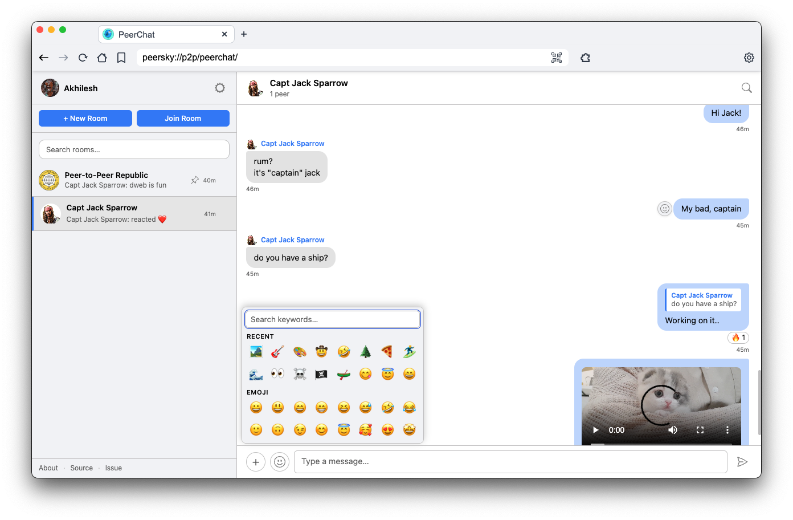

# PeerChat

<div align="center">
    
</div>

Small-group chat inside [PeerSky Browser](https://github.com/p2plabsxyz/peersky-browser). You create a room, share a key, and everyone who has that key joins the same swarm and sees the same history—no chat server in the middle.

**No account.** **Everything stays local** on your machine (room list, profile, keys file)—except what you explicitly sync over the peer network. **You own your chats:** there’s no company holding logs or resetting your password; the room key is the shared secret.

## Who this is for

Small teams or group of friends who already trust each other and want something p2p without sign-up flows.

**Not** a replacement for apps built for journalists, activists, or **very confidential** communication. PeerChat has no verified identities, no perfect forward secrecy, and no professional security audit. If leaking a thread would be serious, use something designed for that threat model 

## What it does

- Rooms with name, bio, optional link, and optional picture
- Messages stored in a **Hypercore** per room (append-only log), synced across peers
- Live delivery over **Hyperswarm** (Noise-encrypted transport) plus **SSE** (`receive-all`) so the web UI updates without polling every room
- Join / leave, @mentions, replies, **emoji reactions** on messages (stored in the room feed and synced like other events), **file attachments** via a dedicated Hyperdrive (`peerchat` shows up in Settings -> Archive like other apps). **No file upload limits** in PeerChat.
- **Direct Messages (DMs):** click a peer's avatar to send a private message; the recipient gets an accept/decline popup, and the room key is derived deterministically from both peer IDs so only those two people share it
- Room list, unread counts, and local settings persist on disk
- **Built-in moderation:** obvious abuse, spam bursts, NSFW terms, and known adult-domain links are filtered before they reach the room feed. Repeat live-message violations can trigger warnings and a short room rejoin cooldown.
- **Emoji picker** in the message composer: type keywords to filter characters; data comes from [emojilib](https://github.com/muan/emojilib), vendored as `lib/emojilib-emoji-en-US.json`.

## How it works

**Room key** — A random 32-byte value shown as hex. It doubles as the Hypercore name/discussion topic and as the secret used to encrypt message payloads before they hit the feed. Sharing the key means sharing read access to that room’s history (with peers who actually have the blocks).

**Data path** — Outgoing messages are encrypted with **AES-256-GCM** using a key derived from the room key (`SHA-256` over a fixed prefix + room key). The feed stores ciphertext + IV + tag; peers decrypt after sync. The wire between peers is already encrypted by the swarm.

**Process split** — The UI (`app.js`, static HTML/CSS) talks to `hyper://chat?action=…` over `fetch` and `EventSource`. The handler in `p2p.js` runs in the main process with the shared Hyper SDK instance: it joins swarms for each saved room, relays JSON lines between peers (newline-delimited), and broadcasts events to all connected SSE clients.

**Storage** — Room metadata, your profile, and encrypted room keys (when available) live in a JSON file under Electron user data (`CHAT_STORAGE` in `p2p.js`, wired from `hyper-handler.js`). Optional **safeStorage** encrypts that blob when the OS supports it.

**Joining again** — Use **Join room** with the 64-character key. For room metadata or keys stored in your archive, open **Settings -> Archive** in PeerSky and look under Hyperdrives for **peerchat-rooms**.

**Moderation path** — Outgoing messages are checked locally before encryption. Live incoming messages are decrypted, checked, and either appended or replaced with a local system notice. History sync uses a content-only check so old filtered messages are not reintroduced when a new peer joins, while the syncing peer is not punished for replaying past history. Kick/rejoin checks use the connection-level peer identity instead of a self-reported message field.

### Moderation details

All moderation runs **locally on each peer**—there is no central authority. Even if a remote peer strips moderation from their build, your node still filters their messages independently.

**Content filters** (applied to every message):

| Filter | What it catches | Source |
|--------|----------------|--------|
| Abuse patterns | Slurs, hate speech, direct threats, common profanity | Regex list in `moderation.js` |
| NSFW patterns | Explicit sexual terms, porn site names | Regex list in `moderation.js` |
| Adult domain blocklist | ~76K known adult domains extracted from URLs in messages | `lib/adult-domains.hosts`, loaded asynchronously at startup via `initModeration()` |

**Spam detection** (remote peers only; local user is exempt):

- A sliding window of `MAX_MSGS_PER_WINDOW` (default **10**) messages within `WINDOW_MS` (default **10 seconds**).
- The 10th message in the window triggers a spam violation.
- Local outgoing messages skip the spam check since they are separately rate-limited at the HTTP handler level (60 requests / 60 seconds).

**Escalation ladder** (tunable constants in `moderation.js`):

| Violation count | Action | Effect |
|-----------------|--------|--------|
| >= `WARNING_THRESHOLD` (1) | `warn` | Message blocked; toast: "Message blocked - please rephrase." |
| >= `FINAL_WARN_THRESHOLD` (2) | `final-warn` | Message blocked; toast: "Message blocked again - please rephrase before sending." |
| >= `KICK_THRESHOLD` (3) | `kick` | **Remote peers:** blocked from all room-scoped message types for `ROOM_REJOIN_COOLDOWN_MS` (5 min). **Local user:** capped to `final-warn` (never self-kicked). |

**Kick cooldown and violation reset:**

- A kicked remote peer is blocked from chat messages, reactions, sync-reactions, room-meta updates, members-list pushes, join announcements, and leave notices for the full cooldown period.
- When the cooldown expires the peer's **violation count resets to zero**, so their next offense starts fresh at `warn`, not an instant re-kick.
- The violation counter also resets independently after `TRACKER_IDLE_TTL_MS` (30 minutes) of inactivity, even without a kick.

## Security

These apps solve different problems; the table is to set expectations, not to pick a “winner.”

| | **Signal** | **Matrix (e.g. Element)** | **PeerChat** |
|---|------------|---------------------------|--------------|
| **Shape** | Central service, E2E by default | Federated homeservers; E2E optional per room | **P2P:** no chat servers; Hyperswarm + Hypercore |
| **Account** | Phone number | Matrix ID + homeserver | **None** |
| **Pros** | Strong E2E story, PFS, large user base, safety numbers | Self-host, bridges, optional E2E | **No signup;** data synced directly between peers; you control local files |
| **Cons** | Depends on Signal’s infrastructure and updates | Server sees metadata; E2E history can be fiddly | **Room key = full access** to history for anyone who gets it; **no PFS** on the room key; metadata on the network is a research topic |
| **Good when** | You want mainstream, audited E2E messaging | You want federation or a public server | You want **local-first, small groups**, same app as Hyper browsing |
| **File uploads** | Platform limits | Varies by server | **No limit** |

**P2P angle:** PeerChat avoids a message database run by a third party, but **discovery and relays** still touch the public stack (DHT, etc.). Noise protects the bytes on the wire; the **room key** protects message content on disk. That’s simpler than Signal’s ratchet—it’s also **weaker** if the key is stolen or shared carelessly.

### PeerChat specifics

- **Room key is the capability.** Anyone with it can join the swarm and decrypt traffic for that room. Treat it like a strong shared secret.
- **No “real” host** in the network sense: peers are symmetric. “Host” in the UI only marks who created the room on that device.
- Rate limits, a max **message text** length, and moderation filters cut spam and obvious unsafe content in the feed; file uploads have **no size limit** in the app. The UI escapes text before rendering to limit XSS.
- Moderation is local and heuristic, not a trust or safety service. It helps with accidental exposure and noisy peers, but it does not replace trusted room keys, identity verification, or user judgment.
- **Not** Matrix/Signal-class identity, device verification, or perfect forward secrecy.

## Development

### Chat API 

PeerChat provides a clean JavaScript API in `chat-api.js` that wraps the protocol handler. Import and use it in your app:

```js
import { chat } from "./path/to/peerchat/chat-api.js";

// Get user profile
const profile = await chat.getProfile();

// Get all rooms
const { rooms, peerProfiles, onlinePeers } = await chat.getRooms();

// Send a message
try {
  await chat.sendMessage(roomKey, { message: "Hello!" });
} catch (err) {
  if (err.status === 403 && err.moderation === true) {
    // Message was blocked locally; check err.error, err.action, and err.remainingMs for details.
  }
}

// React to a message
await chat.react(roomKey, { msgId, emoji: "👍" });

// Subscribe to live updates
const es = new EventSource(chat.receiveAllUrl());
es.addEventListener("message", (ev) => {
  const msg = JSON.parse(ev.data);
  // Handle incoming message
});
```

**Available methods:**
- `chat.getProfile()` — Get current user profile
- `chat.getRooms()` — Get all rooms, peer profiles, online status
- `chat.saveProfile(body)` — Update username, bio, avatar, notifications
- `chat.createRoom(body)` — Create new room with name, bio, link, avatar
- `chat.joinRoom(roomKey)` — Join room by key
- `chat.getHistory(roomKey)` — Get message history for room
- `chat.setActive(roomKey)` — Mark room as active
- `chat.markRead(roomKey)` — Mark room as read
- `chat.sendMessage(roomKey, body)` — Send message with optional reply, file
- `chat.react(roomKey, body)` — React to message with emoji
- `chat.joinDM(body)` — Initiate DM with peer
- `chat.acceptDM(body)` — Accept incoming DM request
- `chat.rejectDM(body)` — Reject incoming DM request
- `chat.updateRoom(roomKey, body)` — Update room settings (pin, mute)
- `chat.deleteRoom(roomKey)` — Leave room
- `chat.requestMeta(roomKey)` — Broadcast a request to connected peers to re-send room metadata (name, bio, avatar, creator)
- `chat.receiveAllUrl()` — Get SSE endpoint URL for live updates

### Porting to another Hyper browser

Copy the `chat/` folder. Your browser already needs a **single shared Hyper SDK** instance (same pattern as PeerSky: one swarm for browsing + apps).

#### 1. Import and initialize after `createSDK`

Use your own path to `p2p.js`. On Electron you can pass `safeStorage` and a file under `userData`; elsewhere omit `safeStorage` or stub it.

```js
import path from "path";
import { app, safeStorage } from "electron"; // or skip safeStorage
import {
  initChat,
  handleChatRequest,
  CHAT_STORAGE,
} from "./path/to/peerchat/p2p.js";

// After: sdk = await createSDK(options)
initChat(sdk, {
  safeStorage, // optional; Electron only
  storagePath: path.join(app.getPath("userData"), CHAT_STORAGE),
});
```

`CHAT_STORAGE` is the JSON filename (`peersky-chat-rooms.json`); change the export in `p2p.js` if you want a different name for your software.

#### 2. Route `hyper://chat` to the handler

PeerSky branches **before** generic `hypercore-fetch` handling so chat never hits the default Hyper resolver. Match your URL shape; PeerSky uses hostname `chat` or path `/chat`:

```js
export async function createHandler(options) {
  await initializeHyperSDK(options); // must call initChat inside this

  return async function protocolHandler(req) {
    const urlObj = new URL(req.url);
    const protocol = urlObj.protocol.replace(":", "");
    const pathname = urlObj.pathname;

    if (
      protocol === "hyper" &&
      (urlObj.hostname === "chat" || pathname.startsWith("/chat"))
    ) {
      return handleChatRequest(req, sdk);
    }

    // …existing hyper:// handling (fetchFn, etc.)
  };
}
```

### Theming

`styles.css` imports [`browser://theme/vars.css`](https://github.com/p2plabsxyz/peersky-browser/blob/main/docs/Theme.md) and maps layout colors from **`--browser-theme-background`**, **`--browser-theme-text-color`**, **`--browser-theme-primary-highlight`**, **`--browser-theme-secondary-highlight`**, and **`--browser-theme-font-family`**, with Peersky extras (`--peersky-nav-background`, `--base02`, etc.) when present. The UI should follow PeerSky’s selected theme and stay compatible with other browsers that implement the same protocol.

> All sound effects used in PeerChat are royalty-free and sourced from [Pixabay](https://pixabay.com/).
